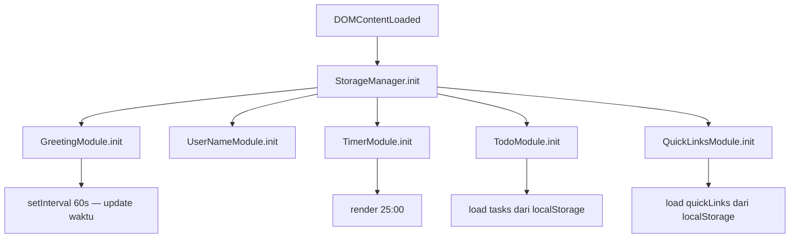
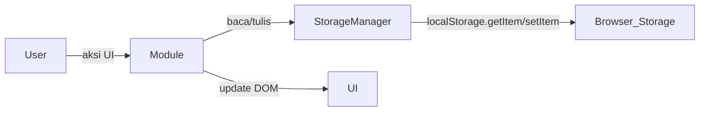

# Design Document — To-Do List Life Dashboard

## Overview

**To-Do List Life Dashboard** adalah aplikasi web Single-Page Application (SPA) yang dibangun sepenuhnya dengan Vanilla HTML, CSS, dan JavaScript tanpa framework atau library eksternal. Aplikasi ini berfungsi sebagai dashboard produktivitas harian yang menggabungkan tujuh widget: Greeting dinamis, Kustomisasi Nama, Focus Timer (Pomodoro), Tema Light/Dark Mode, To-Do List (CRUD + Drag & Drop), dan Quick Links.

### Prinsip Desain Utama

- **Zero-dependency**: Tidak ada npm, bundler, atau CDN library — hanya tiga file inti (`index.html`, `css/style.css`, `js/app.js`).
- **LocalStorage-first**: Semua persistensi data menggunakan `localStorage` browser.
- **Progressive Enhancement**: Preferensi tema mengikuti `prefers-color-scheme` OS sebagai fallback.
- **Single Responsibility per modul**: Setiap widget dikelola oleh modul JavaScript yang terisolasi di dalam satu file `app.js`.

---

## Architecture

### Struktur File

```
project-root/
├── index.html          ← Satu-satunya halaman HTML (SPA)
├── css/
│   └── style.css       ← Tepat satu file CSS
└── js/
    └── app.js          ← Tepat satu file JavaScript
```

### Arsitektur Modul JavaScript

Seluruh kode JavaScript ditulis dalam `app.js` menggunakan **Module Pattern** dengan IIFE (Immediately Invoked Function Expression) atau block scope `{}` untuk menghindari polusi namespace global. Komunikasi antar modul dilakukan melalui fungsi publik atau event listener DOM.

```
app.js
├── StorageManager       — wrapper LocalStorage (get/set/remove) + error handling
├── GreetingModule       — menampilkan waktu, tanggal, dan sapaan
├── UserNameModule       — kustomisasi nama pengguna
├── TimerModule          — Focus Timer (Pomodoro) setInterval
├── ThemeModule          — Light/Dark mode toggle + persistensi localStorage
├── TodoModule           — CRUD task + Drag & Drop reorder
└── QuickLinksModule     — CRUD quick links
```

### Diagram Alur Inisialisasi



### Pola Interaksi Data



---

## Components and Interfaces

### 1. StorageManager

Wrapper tunggal untuk semua operasi LocalStorage. Menangkap `SecurityError` (mode incognito) dan error parsing JSON.

```javascript
StorageManager = {
  get(key)           → any | null
  set(key, value)    → boolean   // true = sukses, false = gagal
  remove(key)        → boolean
  isAvailable()      → boolean   // cek aksesibilitas localStorage
}
```

### 2. GreetingModule

Menampilkan waktu HH:MM, tanggal locale `id-ID`, dan sapaan berdasarkan jam.

**DOM Elements yang dibutuhkan:**
- `#greeting-time` — elemen untuk waktu HH:MM
- `#greeting-date` — elemen untuk tanggal lengkap
- `#greeting-text` — elemen untuk teks sapaan

**Interface:**
```javascript
GreetingModule = {
  init()           → void   // mulai setInterval 60 detik
  render()         → void   // update DOM dengan data waktu terkini
  getGreeting(hour) → string // "Selamat Pagi" | "Selamat Siang" | "Selamat Sore" | "Selamat Malam"
}
```

**Aturan Sapaan:**
| Rentang Jam | Sapaan |
|---|---|
| 00:00 – 11:59 | "Selamat Pagi" |
| 12:00 – 14:59 | "Selamat Siang" |
| 15:00 – 17:59 | "Selamat Sore" |
| 18:00 – 23:59 | "Selamat Malam" |

### 3. UserNameModule

Mengelola input, validasi, dan penyimpanan nama pengguna.

**DOM Elements:**
- `#username-input` — input teks nama
- `#username-save-btn` — tombol simpan
- `#username-error` — pesan kesalahan
- `#username-success` — pesan konfirmasi sukses

**LocalStorage Key:** `userName`

**Interface:**
```javascript
UserNameModule = {
  init()     → void   // load nama dari localStorage, pasang event listener
  save()     → void   // validasi dan simpan, trigger GreetingModule.render()
  clear()    → void   // hapus kunci userName dari localStorage
}
```

**Aturan Validasi:**
- Nama di-`trim()` sebelum disimpan
- Jika hasil trim kosong → hapus kunci `userName`
- Panjang maksimum 50 karakter (setelah trim)
- Pesan error: "Nama tidak boleh melebihi 50 karakter"

### 4. TimerModule

Mengelola countdown Pomodoro 25 menit dengan kontrol Mulai/Jeda/Reset.

**DOM Elements:**
- `#timer-display` — tampilan MM:SS
- `#timer-start-btn` — tombol Mulai
- `#timer-pause-btn` — tombol Jeda
- `#timer-reset-btn` — tombol Reset

**State Internal:**
```javascript
{
  totalSeconds: 1500,   // 25 × 60
  remaining: 1500,
  intervalId: null,
  isRunning: false
}
```

**Interface:**
```javascript
TimerModule = {
  init()   → void
  start()  → void   // setInterval 1000ms
  pause()  → void   // clearInterval, simpan remaining
  reset()  → void   // clearInterval, remaining = 1500, update DOM
  tick()   → void   // decrement remaining, update DOM, cek 00:00
  format(seconds) → string  // misal: 1500 → "25:00"
}
```

### 5. ThemeModule

Mengelola tema tampilan Light/Dark mode dan persistensinya ke localStorage.

**DOM Elements:**
- `#theme-toggle-btn` — tombol toggle tema di header

**LocalStorage Key:** `theme`

**Interface:**
```javascript
ThemeModule = {
  init()              → void   // baca preferensi tersimpan / OS, terapkan tema, pasang listener
  toggle()            → void   // beralih dark↔light, simpan ke localStorage
  applyTheme(theme)   → void   // set data-theme pada <html>, update label tombol
}
```

**Logika penentuan tema awal:**
1. Baca kunci `theme` dari localStorage — jika ada, gunakan nilai tersebut
2. Jika tidak ada, deteksi `prefers-color-scheme` dari OS
3. Fallback ke `"dark"` jika tidak ada preferensi yang terdeteksi

### 6. TodoModule

Mengelola CRUD task dan drag & drop reorder.

**DOM Elements:**
- `#todo-input` — input teks task baru
- `#todo-add-btn` — tombol tambah
- `#todo-list` — container `<ul>` daftar task
- `#todo-error` — pesan kesalahan

**LocalStorage Key:** `tasks`

**Interface:**
```javascript
TodoModule = {
  init()                    → void
  loadFromStorage()         → Task[]
  saveToStorage(tasks)      → boolean
  renderAll(tasks)          → void
  renderItem(task)          → HTMLElement
  addTask(text)             → void
  toggleTask(id)            → void
  deleteTask(id)            → void
  startEdit(id)             → void
  saveEdit(id, newText)     → void
  cancelEdit(id)            → void
  // Drag & Drop
  initDragDrop()            → void
  onDragStart(event)        → void
  onDragOver(event)         → void
  onDrop(event)             → void
  onDragEnd(event)          → void
}
```

**Drag & Drop — pendekatan:**
- Gunakan HTML5 `draggable="true"` pada setiap `<li>` task
- `dragstart` → catat `dataset.id` task yang diseret
- `dragover` → `preventDefault()` untuk mengizinkan drop + tampilkan placeholder
- `drop` → reorganisasi array, simpan ke localStorage, re-render
- `dragend` → bersihkan kelas visual

### 7. QuickLinksModule

Mengelola tambah, tampil, dan hapus Quick Links.

**DOM Elements:**
- `#link-name-input` — input nama link
- `#link-url-input` — input URL
- `#link-add-btn` — tombol tambah
- `#link-name-error` — pesan error nama
- `#link-url-error` — pesan error URL
- `#quick-links-list` — container daftar link
- `#quick-links-empty` — pesan saat daftar kosong

**LocalStorage Key:** `quickLinks`

**Interface:**
```javascript
QuickLinksModule = {
  init()                    → void
  loadFromStorage()         → LinkItem[]
  saveToStorage(links)      → boolean
  renderAll(links)          → void
  renderItem(link)          → HTMLElement
  addLink(name, url)        → void
  deleteLink(id)            → void
  validateUrl(url)          → boolean  // cek http:// atau https://
}
```

---

## Data Models

### Task

```javascript
/**
 * @typedef {Object} Task
 * @property {string}  id        - UUID atau timestamp string unik
 * @property {string}  text      - Teks deskripsi tugas (1–200 karakter)
 * @property {boolean} completed - Status penyelesaian
 * @property {number}  order     - Urutan tampilan (0-indexed)
 */

// Contoh:
{
  id: "task-1718000000000",
  text: "Selesaikan laporan mingguan",
  completed: false,
  order: 0
}
```

**LocalStorage Key:** `tasks`
**Format:** JSON array of Task — `JSON.stringify([Task, Task, ...])`

### LinkItem

```javascript
/**
 * @typedef {Object} LinkItem
 * @property {string} id   - UUID atau timestamp string unik
 * @property {string} name - Label tampilan link (1–50 karakter)
 * @property {string} url  - URL target (harus diawali http:// atau https://)
 */

// Contoh:
{
  id: "link-1718000000001",
  name: "GitHub",
  url: "https://github.com"
}
```

**LocalStorage Key:** `quickLinks`
**Format:** JSON array of LinkItem

### Skema LocalStorage

| Key | Tipe | Deskripsi |
|---|---|---|
| `userName` | `string` | Nama pengguna (setelah di-trim) |
| `tasks` | `string` (JSON) | Array of Task |
| `quickLinks` | `string` (JSON) | Array of LinkItem |
| `theme` | `string` | Preferensi tema: `"dark"` atau `"light"` |

### ID Generation

```javascript
// Menggunakan kombinasi prefix + Date.now() untuk ID unik sederhana
function generateId(prefix) {
  return `${prefix}-${Date.now()}-${Math.random().toString(36).slice(2, 7)}`;
}
```

---

## Correctness Properties

*A property is a characteristic or behavior that should hold true across all valid executions of a system — essentially, a formal statement about what the system should do. Properties serve as the bridge between human-readable specifications and machine-verifiable correctness guarantees.*

> **Catatan Reflection:** Property 1 dan Property 2 dari draft awal (keduanya menguji `getGreeting()`) digabung menjadi satu property komprehensif karena "output selalu valid" dan "partisi tidak tumpang tindih/tidak ada celah" adalah dua cara menguji predikat yang sama. Property tunggal yang lebih kuat dipilih.

---

### Property 1: Partisi Sapaan Lengkap, Tidak Tumpang Tindih, dan Tidak Memiliki Celah

*For any* jam `h` di mana h ∈ [0, 23], fungsi `getGreeting(h)` SHALL mengembalikan tepat satu dari keempat string sapaan berikut tanpa tumpang tindih dan tanpa celah:
- h ∈ [0, 11] → tepat `"Selamat Pagi"`
- h ∈ [12, 14] → tepat `"Selamat Siang"`
- h ∈ [15, 17] → tepat `"Selamat Sore"`
- h ∈ [18, 23] → tepat `"Selamat Malam"`

Output tidak pernah berupa string lain, `null`, atau `undefined`.

**Validates: Requirements 1.3, 1.4, 1.5, 1.6**

---

### Property 2: Format Tampilan Greeting dengan Nama Pengguna

*For any* nama pengguna yang valid (non-kosong setelah `trim()`, panjang ≤50 karakter) yang tersimpan di localStorage, teks sapaan yang dirender SHALL mengandung string sapaan waktu yang sesuai diikuti nama pengguna tersebut dalam format `"[Sapaan], [Nama]!"`.

**Validates: Requirements 1.7, 2.2**

---

### Property 3: Validasi Panjang Nama Pengguna — Tolak Jika Melebihi Batas

*For any* string input nama pengguna di mana panjang setelah `trim()` lebih dari 50 karakter, sistem SHALL menolak penyimpanan sehingga nilai `localStorage.getItem('userName')` tidak berubah dari nilai sebelum percobaan penyimpanan.

**Validates: Requirements 2.5**

---

### Property 4: Input Whitespace Sebagai Nama Pengguna Menghapus Kunci userName

*For any* string yang terdiri sepenuhnya dari karakter whitespace (spasi, tab, newline, atau kombinasinya), memanggil fungsi simpan User_Name SHALL menghapus kunci `userName` dari localStorage sehingga `localStorage.getItem('userName')` bernilai `null`.

**Validates: Requirements 2.4**

---

### Property 5: Penambahan Task Valid Menambah Panjang Array Tepat Satu

*For any* array task yang ada dan teks task yang valid (non-whitespace setelah `trim()`, panjang ≤200 karakter), memanggil `addTask(text)` SHALL menghasilkan array task yang panjangnya bertambah tepat 1, task baru dapat ditemukan dalam array dengan properti `text === input.trim()` dan `completed === false`.

**Validates: Requirements 5.2, 5.3**

---

### Property 6: Input Kosong atau Whitespace Sebagai Task Ditolak

*For any* string yang terdiri sepenuhnya dari karakter whitespace (termasuk string kosong `""`), memanggil `addTask(text)` SHALL menolak penambahan sehingga panjang array task tetap tidak berubah.

**Validates: Requirements 5.6**

---

### Property 7: Round-Trip Serialisasi Task ke LocalStorage

*For any* array Task yang valid, operasi menyimpan ke localStorage kemudian membaca dan mem-parse kembali (`JSON.parse(localStorage.getItem('tasks'))`) SHALL menghasilkan array yang ekuivalen secara struktural — semua properti `id`, `text`, `completed`, dan `order` pada setiap task terjaga nilainya.

**Validates: Requirements 5.3, 5.4, 11.3**

---

### Property 8: Toggle Status Task adalah Operasi Involusi (Invers Dirinya Sendiri)

*For any* task dengan nilai `completed` awal tertentu, memanggil `toggleTask(id)` dua kali secara berurutan SHALL mengembalikan properti `completed` task tersebut ke nilai semula — berlaku baik saat memulai dari `false` maupun dari `true`.

**Validates: Requirements 6.2, 6.3**

---

### Property 9: Penghapusan Task Mengurangi Panjang Array Tepat Satu

*For any* array task yang mengandung setidaknya satu task, memanggil `deleteTask(id)` dengan `id` yang valid dari array tersebut SHALL menghasilkan array task dengan panjang berkurang tepat 1 dan task dengan `id` tersebut tidak lagi ditemukan di array hasil.

**Validates: Requirements 6.5**

---

### Property 10: Edit Lalu Batal Tidak Mengubah State Task

*For any* task dengan teks tertentu, urutan operasi `startEdit(id)` diikuti `cancelEdit(id)` SHALL menghasilkan task dengan `text` yang identik dengan sebelum edit dan nilai localStorage `tasks` yang tidak berubah.

**Validates: Requirements 7.5**

---

### Property 11: Drag & Drop Mempertahankan Himpunan Task (Invariant Konten)

*For any* array task dengan minimal dua elemen dan operasi drag & drop yang memindahkan elemen dari satu indeks ke indeks lain, array task setelah reorder SHALL mengandung himpunan `id` yang identik dengan himpunan `id` sebelum reorder — tidak ada task yang hilang, tidak ada task baru, dan tidak ada duplikasi.

**Validates: Requirements 8.2, 8.3**

---

### Property 12: Validasi URL Quick Links — Tolak Jika Tidak Diawali http/https

*For any* string URL yang tidak diawali dengan `"http://"` atau `"https://"`, fungsi `validateUrl(url)` SHALL mengembalikan `false` dan memanggil `addLink()` dengan URL tersebut SHALL menolak penambahan sehingga panjang array quickLinks tidak berubah.

**Validates: Requirements 9.8**

---

### Property 13: Setiap Link Item Dirender sebagai Elemen `<a>` yang Aman

*For any* array LinkItem yang valid dengan minimal satu elemen, memanggil `renderAll()` SHALL menghasilkan elemen `<a>` untuk setiap LinkItem dengan atribut `target="_blank"` dan `rel="noopener noreferrer"`, dan href yang sesuai dengan properti `url` LinkItem tersebut.

**Validates: Requirements 9.5**

---

### Property 14: Round-Trip Serialisasi Quick Links ke LocalStorage

*For any* array LinkItem yang valid, operasi menyimpan ke localStorage kemudian membaca dan mem-parse kembali (`JSON.parse(localStorage.getItem('quickLinks'))`) SHALL menghasilkan array yang ekuivalen secara struktural — semua properti `id`, `name`, dan `url` pada setiap LinkItem terjaga nilainya.

**Validates: Requirements 9.3, 9.4, 11.3**

---

### Property 15: Penghapusan Quick Link Mengurangi Panjang Array Tepat Satu

*For any* array quickLinks yang mengandung setidaknya satu link, memanggil `deleteLink(id)` dengan `id` yang valid SHALL menghasilkan array dengan panjang berkurang tepat 1 dan link dengan `id` tersebut tidak lagi ditemukan di array hasil.

**Validates: Requirements 10.2**

---

### Property 16: Format Timer Selalu Menghasilkan String MM:SS yang Valid

*For any* nilai integer `seconds` di mana seconds ∈ [0, 1500], fungsi `format(seconds)` SHALL mengembalikan string yang cocok dengan pola regex `/^\d{2}:\d{2}$/` di mana komponen menit MM ∈ ["00", "25"] dan komponen detik SS ∈ ["00", "59"].

**Validates: Requirements 3.1, 3.3**

---

## Error Handling

### Matriks Error dan Penanganannya

| Skenario | Komponen | Penanganan |
|---|---|---|
| LocalStorage tidak tersedia (incognito) | StorageManager | Tampilkan banner peringatan "Data tidak dapat disimpan secara permanen" |
| JSON.parse gagal pada data `tasks` | TodoModule | Kembalikan array kosong `[]`, tampilkan daftar kosong |
| JSON.parse gagal pada data `quickLinks` | QuickLinksModule | Kembalikan array kosong `[]`, tampilkan pesan kosong |
| Input nama kosong/whitespace saat simpan | UserNameModule | Hapus kunci `userName`, update greeting |
| Nama > 50 karakter | UserNameModule | Tampilkan error "Nama tidak boleh melebihi 50 karakter" |
| Task teks kosong/whitespace | TodoModule | Tampilkan error "Tugas tidak boleh kosong", tolak penambahan |
| Task teks > 200 karakter | TodoModule | Tampilkan error "Tugas tidak boleh melebihi 200 karakter", tolak |
| Edit task kosong/whitespace | TodoModule | Tampilkan error "Tugas tidak boleh kosong", pertahankan teks lama |
| localStorage.setItem gagal (quota exceeded) | StorageManager | Kembalikan false, modul tampilkan pesan error singkat |
| Toggle task gagal simpan ke localStorage | TodoModule | Rollback status checkbox ke nilai sebelumnya |
| Drag & drop gagal simpan ke localStorage | TodoModule | Rollback urutan visual ke sebelum drag |
| Quick link gagal hapus dari localStorage | QuickLinksModule | Kembalikan item ke tampilan, tampilkan "Gagal menghapus link..." |
| URL tidak diawali http:// atau https:// | QuickLinksModule | Tampilkan error "URL harus diawali dengan http:// atau https://" |
| Nama link kosong | QuickLinksModule | Tampilkan error "Nama link tidak boleh kosong" |
| URL kosong | QuickLinksModule | Tampilkan error "URL tidak boleh kosong" |
| Nilai `theme` di localStorage tidak valid | ThemeModule | Abaikan, gunakan preferensi OS atau fallback ke `"dark"` |

### Prinsip Error Handling

1. **Tidak ada error yang melempar exception ke console tanpa ditangkap** — semua `try/catch` mencakup operasi localStorage dan JSON.
2. **Rollback visual** — jika operasi gagal setelah perubahan DOM, DOM dikembalikan ke state sebelumnya.
3. **Pesan error langsung dan spesifik** — ditampilkan di dekat elemen yang bermasalah, bukan di console.
4. **Degradasi graceful** — tema mengikuti preferensi OS jika localStorage belum pernah menyimpan pilihan pengguna.

---

## Testing Strategy

### Pendekatan Pengujian

Aplikasi ini merupakan Vanilla JS SPA tanpa framework. Strategi pengujian menggunakan dua lapisan komplementer:

1. **Unit Tests (Example-Based)** — untuk perilaku spesifik dan edge case
2. **Property-Based Tests (PBT)** — untuk properti universal yang harus berlaku di semua input yang valid

### Library yang Digunakan

- **Property-Based Testing**: [fast-check](https://fast-check.dev/) (JavaScript PBT library)
- **Test Runner**: [Vitest](https://vitest.dev/) atau [Jest](https://jestjs.io/) (keduanya mendukung ESM)
- Minimum **100 iterasi** per property test (default fast-check)

### Cakupan Property Tests

Setiap property test harus diberi tag referensi ke properti desain:

```javascript
// Tag format: Feature: todo-list-life-dashboard, Property N: <deskripsi singkat>
```

| Property | Generator | Verifikasi | Library |
|---|---|---|---|
| P1 – Partisi Sapaan Lengkap | `fc.integer({min:0, max:23})` | getGreeting(h) tepat satu dari 4 nilai valid, sesuai rentang | fast-check |
| P2 – Greeting dengan Nama | `fc.string({minLength:1, maxLength:50})` (non-pure-whitespace) | output mengandung `"[Sapaan], [nama]!"` | fast-check |
| P3 – Tolak Nama > 50 Char | `fc.string({minLength:51, maxLength:200})` | localStorage.getItem('userName') tidak berubah | fast-check |
| P4 – Whitespace Nama → Hapus Kunci | `fc.stringOf(fc.constantFrom(' ','\t','\n'))` | localStorage.getItem('userName') === null | fast-check |
| P5 – Penambahan Task | `fc.array(taskArb)` + `fc.string({minLength:1,maxLength:200})` (non-ws) | panjang +1, task baru ada, completed=false | fast-check |
| P6 – Task Whitespace Ditolak | `fc.stringOf(fc.constantFrom(' ','\t','\n'))` | panjang tidak berubah | fast-check |
| P7 – Round-Trip Task | `fc.array(taskArb)` | JSON.parse(JSON.stringify(tasks)) ekuivalen | fast-check |
| P8 – Toggle Involusi | `fc.record({id, text, completed: fc.boolean(), order: fc.nat()})` | toggle dua kali = completed awal | fast-check |
| P9 – Penghapusan Task | `fc.array(taskArb, {minLength:1})` + index acak | panjang -1, id hilang dari array | fast-check |
| P10 – Edit → Batal = Tidak Berubah | `fc.record(taskArb)` + `fc.string()` teks edit | task.text sama, localStorage sama | fast-check |
| P11 – Drag & Drop Invariant Konten | `fc.array(taskArb, {minLength:2})` + dua indeks berbeda | himpunan id identik sebelum dan sesudah | fast-check |
| P12 – Tolak URL Non-http/https | `fc.string().filter(s => !s.startsWith('http://') && !s.startsWith('https://'))` | validateUrl = false, links.length tidak berubah | fast-check |
| P13 – Render Link sebagai `<a>` Aman | `fc.array(linkArb, {minLength:1})` | setiap `<a>` punya target="_blank" dan rel="noopener noreferrer" | fast-check |
| P14 – Round-Trip Quick Links | `fc.array(linkArb)` | JSON.parse(JSON.stringify(links)) ekuivalen | fast-check |
| P15 – Penghapusan Quick Link | `fc.array(linkArb, {minLength:1})` + index acak | panjang -1, id hilang dari array | fast-check |
| P16 – Format Timer MM:SS | `fc.integer({min:0, max:1500})` | output cocok `/^\d{2}:\d{2}$/` | fast-check |

### Cakupan Unit Tests (Example-Based)

| Modul | Skenario |
|---|---|
| StorageManager | `isAvailable()` mock SecurityError, fallback saat setItem gagal |
| GreetingModule | Tampilan tanpa nama, tampilan dengan nama, locale date format |
| TimerModule | Start → interval terdaftar, Pause → interval berhenti, Reset → 25:00, format tepat batas (0, 1500) |
| ThemeModule | Toggle dark→light, toggle light→dark, load dari localStorage, fallback ke preferensi OS |
| TodoModule | Tambah task valid, edit lalu simpan, batalkan edit → teks asli, load data valid, load data JSON invalid |
| QuickLinksModule | URL valid, empty state message saat list kosong, load dari localStorage |

### Catatan Implementasi Testing

- Modul JavaScript diekspos sebagai pure functions yang dapat diimpor/di-stub secara independen.
- DOM testing menggunakan `jsdom` (disertakan dalam Vitest/Jest secara bawaan).
- localStorage di-mock menggunakan `localStorage.setItem = jest.fn()` atau `vi.stubGlobal`.
- `window.matchMedia` di-mock untuk menguji deteksi preferensi OS pada ThemeModule.
